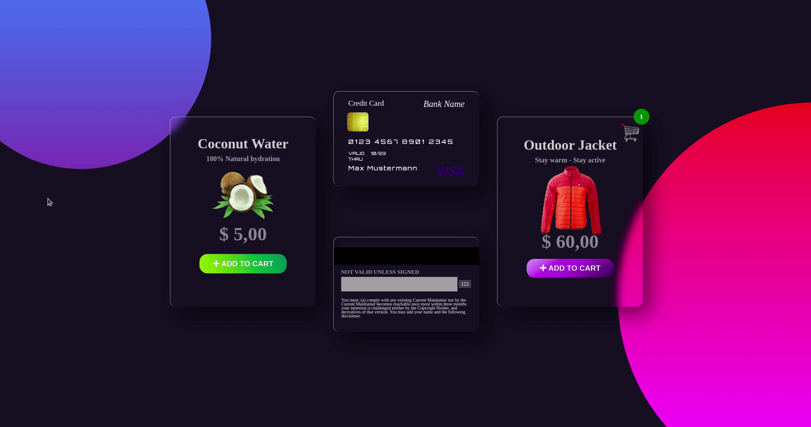

## Glassmorphism Cards

[Live Demo](https://mandyneumeyer.github.io/glassmorphism/)

### Desktop



---

### Tablet


**Background**
```css
body::before and body::after 
position:absolute
linear-gradient
clip-path: circle(50% at 50% 50%)
```
* first value for the radius
* at, followed by 2 values determining the x- and y-coordinates to establish where the center of the circle is


linear-gradient


